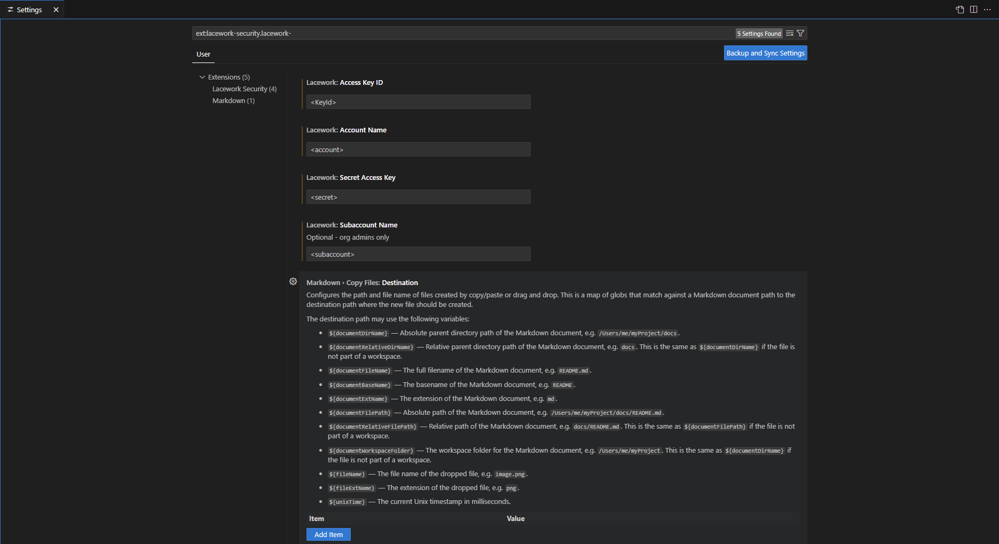

# Prerequisites

Before you begin building and testing Code Security in **Lacework FortiCNAPP**, ensure the following prerequisites are met.

## Accounts and Access

!!! note "**Lacework FortiCNAPP** Access"
    - A valid **Lacework FortiCNAPP**  account  
    - API **Key** and **Secret** with IaC Policy permissions

## Required Tools

| Tool            | Description                             |
|-----------------|-----------------------------------------|
| `lacework` CLI  | FortiCNAPP CLI with IaC component       |
| `VS Code`       | Lacework Security VS Code Extension     |
| `GitHub` CLI    | `gh` commands are included in the HoLs  |

??? tip "Install CLI"

     **Bash (macOS/Linux)**

    ```bash
    curl https://raw.githubusercontent.com/lacework/go-sdk/main/cli/install.sh | sudo bash
    ```
    
    **Powershell (Windows)**
    
    ```bash
    Set-ExecutionPolicy Bypass -Scope Process -Force
    iex ((New-Object System.Net.WebClient).DownloadString('https://raw.githubusercontent.com/lacework/go-sdk/main/cli/install.ps1'))
    ```
    
    **Homebrew (macOS/Linux)**
    
    ```bash
    brew install lacework/tap/lacework-cli
    ```
    
    **Chocolatey (Windows)**
    
    ```bash
    choco install lacework-cli
    ```

??? tip "Configure your API Key"

    The  Lacework FortiCNAPP CLI requires an API key and secret to authenticate.
    
    1. Log in to the **Lacework FortiCNAPP** Console
    2. Navigate to **Settings > API keys**
    3. Click **Add New**
    4. Provide a name and optional description
    5. Click **Save**
    6. Click the **⋯ (more)** icon and select **Download**
    
    This downloads a JSON file like:
    
    ```json
    {
      "keyId": "ACCOUNT_ABCDEF01234559B9B07114E834D8570F567C824039756E03",
      "secret": "_abc1234e243a645bcf173ef55b837c19",
      "subAccount": "myaccount",
      "account": "myaccount.lacework.net"
    }
    ```

??? tip "Configure the CLI"

    You can configure using the interactive prompt:
    
    ```bash
    lacework configure
    ```
    
    Or with the downloaded API key file:
    
    ```bash
    lacework configure -j /path/to/key.json
    ```
    
    Example output:
    
    ```text
    Account: example
    Access Key ID: EXAMPLE_1234567890ABCDE1EXAMPLE1EXAMPLE123456789EXAMPLE
    Secret Access Key: **********************************
    You are all set!
    ```
    
    The configuration is stored at:
    
    ```text
    $HOME/.lacework.toml
    ```

??? danger "Don't Forget to Install Lacework CLI Components"

    **Install the Lacework FortiCNAPP CLI components for IAC and SCA:**
    
    1. Run `lacework component install iac` in the Lacework FortiCNAPP CLI.
    2. Run `lacework component install sca` in the Lacework FortiCNAPP CLI.

??? tip "Configure the Lacework VSCode extension"

    **Open VSCode**
    
    1. Install the **Lacework Security** extension from the Marketplace
    
       
    
    2. Click the **Lacework shield icon** in the sidebar
    
       
    
    3. In the search bag, type `ext:lacework-security.lacework` and fill-in the API tokens from [Prerequisites](00-prerequisites.md#required-tools) in `configure your API key`.
    
       

## Environment

- Unix-based terminal (macOS, Linux, or WSL on Windows)
- Internet connection (for policy downloads)

## Optional Tools

!!! info "Recommended Tools"
    - `tree`: To view directory structures
    - `jq`: To parse CLI JSON output
