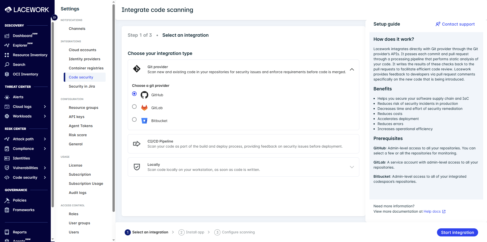
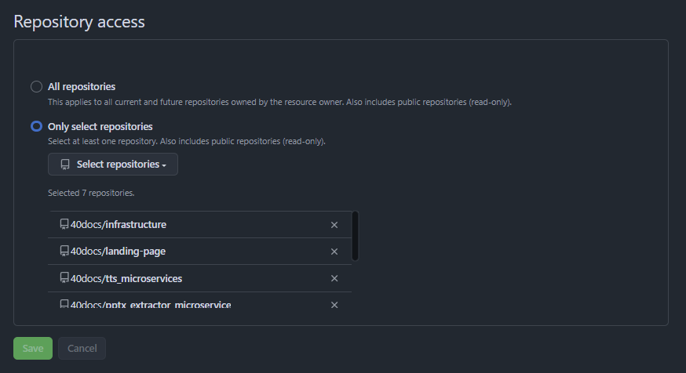
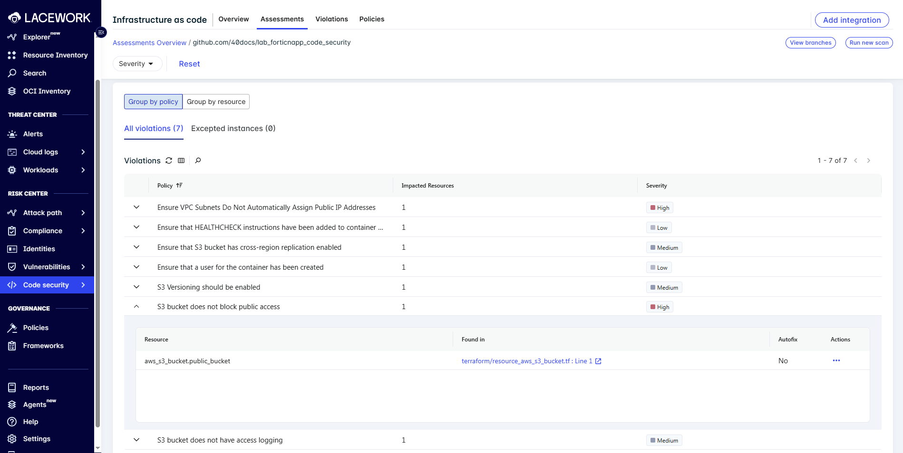
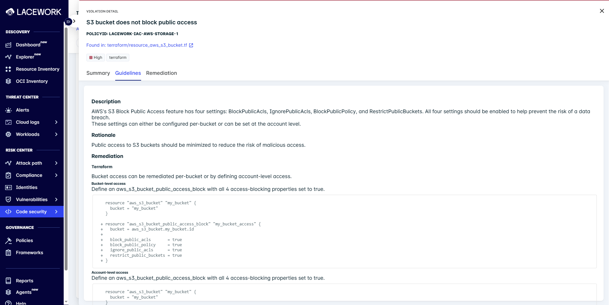

---
buttons:
  - title: Hands on Lab - Download
    icon: material-file-download-outline
    attributes:
      class: md-content__button md-icon
      href: ../hands-on-labs.pdf
      target: _blank
---

# Infrastructure-as-Code (IaC)

Lacework FortiCNAPP's **IaC Security** statically analyzes cloud infrastructure templates like Terraform, CloudFormation, Kubernetes, and Dockerfiles to detect misconfigurations before deployment.

!!! tip "Proactive IaC Security"
    Integrating early in the SDLC lets you catch cloud misconfigurations before runtime—shifting security left.

---

## Getting Started with IaC Security

To get started, connect the **Code Security App** to your Git provider.

Lacework FortiCNAPP supports repository integration through **GitHub, GitLab, and Bitbucket**.

To connect your version control system:

- Navigate to **Settings → Integrations → Code Security** in the Lacework Console
- Choose your Git provider
- Follow the interactive authorization flow

!!! tip
    You must have **Owner or Admin access** to install integration apps for your organization.

For a full GitHub walkthrough, see the [Hands-On](#step-2-install-the-github-app) section below.

---

## Supported IaC Technologies

### Supported Languages & File Types

| **Language / Tool** | Code Security App | CI/CD | CLI |
| ------------------- | ----------------- | ----- | --- |
| CloudFormation      | ✅                 | ✅     | ✅   |
| Dockerfiles         | ✅                 | ✅     | ✅   |
| Helm Charts         | ✅                 | ✅     | ✅   |
| Kustomize           | ✅                 | ✅     | ✅   |
| Terraform           | ✅                 | ✅     | ✅   |

---

### Supported Git Providers

| Git Provider        | Supported |
| ------------------- | --------- |
| Bitbucket           | ✅         |
| GitHub              | ✅         |
| GitLab              | ✅         |
| Azure DevOps        | ❌         |
| GitHub Enterprise   | ❌         |
| GitLab Self-Managed | ❌         |

---

### Supported CI/CD Pipelines

| CI/CD Pipeline      | Supported |
| ------------------- | --------- |
| GitHub Actions      | ✅         |
| GitLab CI           | ✅         |
| Bitbucket Pipelines | ✅         |
| Jenkins             | ✅         |

---

### Supported Terraform Tools

| Terraform Tool       | Supported |
| -------------------- | --------- |
| Atlantis             | ✅         |
| Terraform Cloud      | ❌         |
| Terraform Enterprise | ❌         |
| Env0 / Spacelift     | ❌         |
| Terragrunt           | ✅         |

---

## Hands-On

Follow this quick lab to trigger misconfig findings and see FortiCNAPP in action.

---

### Step 1: Create a New Project from the Template

```bash
gh repo create lab_forticnapp_code_security --template 40docs/lab_forticnapp_code_security --public
cd lab_forticnapp_code_security
```

This repo includes Terraform configs with real-world misconfigurations.

---

### Step 2: Install the GitHub App

#### Prerequisites

- Authorized installation of the GitHub **Lacework IaC Security** App
- You must have **Owner permissions** for the GitHub organization you want to integrate.

!!! example "Configuring the GitHub Integration"

    === "Steps: FortiCNAPP"

        {align=left width=325}

        1. Log in to the **Lacework FortiCNAPP Console**
        2. Go to **Settings → Integrations → Code Security**
        3. Click **Add Integration**
        4. Select **Integration Type**: `GitHub`
        5. Click **Go to GitHub** and sign in

    === "Steps: GitHub"

        {align=left width=325}

        1. Select your **GitHub organization**, then click **Configure**
        2. Using the dropdown, choose **All repositories**, or **Only select repositories**
        3. Click **Install & Authorize**

    === "What Happens After"

        - Scans start on the **default branch**
        - You can manage which scanners are enabled (IaC, SCA, SAST, Secrets)
        - Results appear in the **Code Security UI**

---

### Step 3: View IaC Scan Results

1. Open the **Lacework Console → Code Security → Repositories**
2. Click your repo to see:

   - ❌ Public S3 buckets
   - ❌ Subnets with public IPs
   - ✅ Inline file/line findings

!!! tip "Interactive Feedback"

    Click a finding to view exact source line, path, and fix recommendation.

    === "Assessments"

        

    === "Violation Details"

        

---

### Step 4: Enforce Checks with Branch Protection

1. In your repo, go to **Settings → Branches**
2. Edit or create a rule for `main`
3. Enable:
   - ✅ Require pull request review
   - ✅ Require status checks to pass
4. Add the **Lacework Code Security** check (if available)

---

### Optional: Scan Locally with the CLI

If you have the Lacework CLI:

```bash
lacework iac scan --directory ./terraform --output iac-results.json
```

!!! note "Configure API Access First"
    Run `lacework configure` before scanning to set up your account keys.

---

### Sample Violations

```hcl
# terraform/resource_aws_s3_bucket.tf
resource "aws_s3_bucket" "public_bucket" {
  bucket = "lab-iac-demo-bucket"
  acl    = "public-read"  # ❌
}
```

```hcl
# terraform/resource_aws_subnet.tf
resource "aws_subnet" "public" {
  map_public_ip_on_launch = true  # ❌
}
```

These trigger findings like:

* “S3 bucket should not be public”
* “Subnets should not assign public IPs by default”

---

## Best Practices

* ✅ Install the GitHub App to enable automated scans
* ✅ Use branch protection to enforce security gates
* ✅ Enable AutoFix to remediate issues with 1-click
* ✅ Run CLI scans locally to catch issues before pushing
