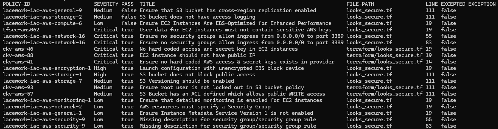
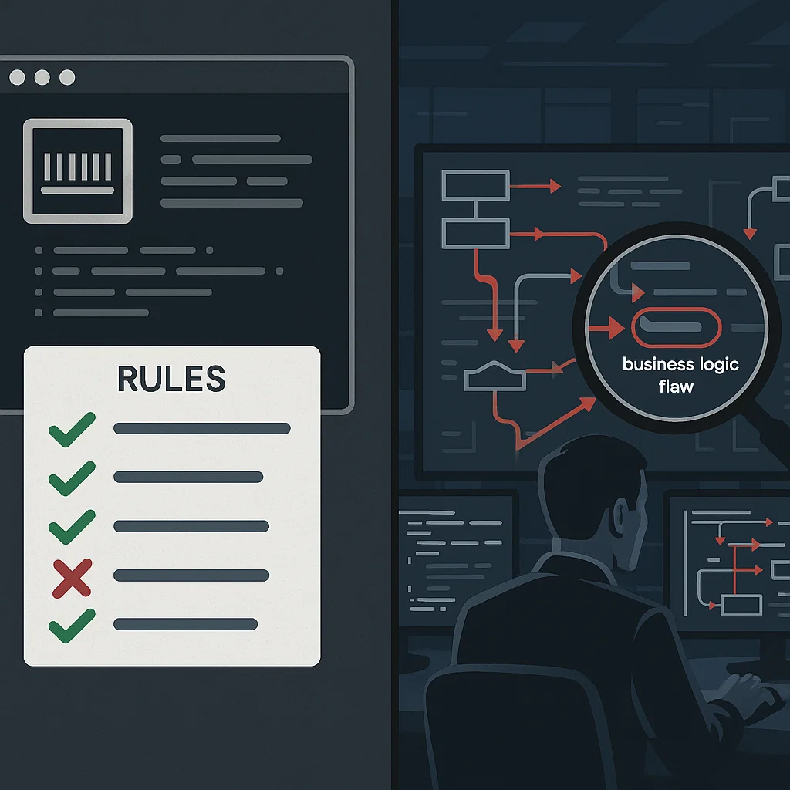

---
buttons:
  - title: Hands on Lab - Download
    icon: material-file-download-outline
    attributes:
      class: md-content__button md-icon
      href: ../hands-on-labs.pdf
      target: _blank
---

# OPAL

Welcome to the FortiCNAPP OPAL Lab. This guide demonstrates why generic security scanning - while necessary - isn't sufficient for enterprise security. You need custom OPAL policies to enforce your organization's specific requirements.


> **Standard scanners perform basic security tricks. OPAL delivers real security magic - enforcing YOUR business
  requirements.**

---

## OPAL Overview

OPAL is FortiCNAPP's IaC static analyzer based on the **OPA framework** and **Rego** language. OPAL evaluates infrastructure as code (IaC) files for potential AWS, Azure, Google Cloud, and Kubernetes security and compliance violations prior to deployment.

!!! info "Supported Frameworks"
    | Framework                    | Format         |
    |------------------------------|----------------|
    | Azure Resource Manager (ARM) | JSON           |
    | CloudFormation               | JSON, YAML     |
    | Kubernetes                   | YAML           |
    | Terraform                    | HCL, JSON Plan |

OPAL is part of the IaC component within the FortiCNAPP CLI. The FortiCNAPP CLI works with CI/CD tools such as **Jenkins**, **Circle CI**, **GitHub Actions**, and **GitLab Pipelines**.

---

## The Security Gap

**Surface-Level vs. Deep Analysis**


> Standard IaC scanners lack visibility into what actually matters - they're flying blind when it comes to YOUR unique requirements and constraints.

**What Generic Scanners Find:**

- Open ports to 0.0.0.0/0 (obvious misconfigurations)
- Missing encryption (checkbox compliance)
- Public S3 buckets (well-known risks)

**What YOUR Business Actually Needs:**

- Environment-Specific Rules: Production workloads MUST use YOUR approved configurations
- Organizational Standards: Resources MUST follow YOUR team's naming and tagging requirements
- Custom Compliance: Systems MUST integrate with YOUR specific security and monitoring tools
- Business Logic: Critical services MUST meet YOUR defined reliability and recovery standards

**The Reality:** Generic scanners are like having spell-check review your contracts - helpful, but they won't catch that you forgot a critical business clause.

---

## What You'll Learn

- Why standard IaC scanning isn't enough for enterprise security
- How to create custom OPAL policies that enforce YOUR business logic
- The critical importance of testing both pass AND fail scenarios
- How OPAL catches violations that standard scanners miss

---


## Part 1: The Problem - When Standard Scanning Isn't Enough

### Your Organization's Requirements

Let's say your company has specific security requirements:

- Production web servers MUST use specific security groups for audit logging
- Development and production resources must NEVER share security groups
- ALL production instances require an audit logging security group

### Exercise: Run Standard IaC Scan

First, examine infrastructure that looks secure to standard scanners:

```bash
# Clone the demo repository
git clone https://github.com/40docs/lab-forticnapp-opal.git
cd lab-forticnapp-opal

# Look at the "secure" infrastructure
cat terraform/looks_secure.tf

# Run standard IaC scan
lacework iac scan -d terraform/
```

### Scan Results Analysis

{ align=right width=300 height=300 }

**What Standard Scanning Finds:**

- ✅ Most checks PASS
- ⚠️ Only 3 minor issues:
  - S3 bucket missing cross-region replication (Medium)
  - S3 bucket missing access logging (Medium)
  - EC2 not EBS-optimized (Low)

**What's Actually Wrong (that standard scanning missed):**

- ❌ Production server missing required audit-logging security group
- ❌ Security group exists but isn't attached to production instances
- ❌ Business compliance requirement completely ignored

!!! warning "The Gap"
    Standard scanners found 3 minor operational issues but missed a critical business security requirement!

---

## Part 2: The Solution - Custom Policies with OPAL

### Understanding OPAL Policy Components

!!! info "What You'll Build"
    A custom OPAL policy consists of three key components:

    1. **metadata.yaml** - Defines policy properties (ID, severity, description)
    2. **policy.rego** - Contains the actual business logic in Rego language
    3. **test cases** - Validates your policy works correctly (pass AND fail scenarios)

### Choose Your Path

=== "Option A: Use Existing Example"

    The cloned repository contains a working policy. Let's understand what it does:

    ```bash
    # Examine the policy structure
    ls -la policies/opal/my_audit_policy/
    # Output:
    # metadata.yaml     - Policy definition
    # policy.rego       - Business logic
    # terraform/tests/  - Test cases
    ```

    **What This Policy Does:**
    - Enforces that production EC2 instances MUST have an audit-logging security group
    - Allows development instances to skip this requirement
    - Demonstrates how to check resource tags and security group assignments

=== "Option B: Create From Scratch"

    Build your own custom policy step by step:

    ```bash
    # IMPORTANT: Stay in the repository root directory for all commands
    # From the lab-forticnapp-opal directory
    pwd  # Should show: .../lab-forticnapp-opal

    # Create policy directory structure
    mkdir -p policies/opal/my_org_policy
    ```

### Step 1: Define Policy Metadata

**Understanding metadata.yaml:**
This file tells FortiCNAPP what your policy checks and how severe violations are.

=== "Examine Existing"

    ```bash
    cat policies/opal/my_audit_policy/metadata.yaml
    ```

    ```yaml
    policy_id: "my-audit-requirement"        # Unique identifier
    title: "Production Audit Logging"        # Human-readable name
    severity: "High"                          # High/Medium/Low
    description: "Production instances must have audit logging"
    resource_type: "aws_instance"            # What to check
    provider: "aws"                          # Cloud provider
    category: "Compliance"                   # Policy category
    ```

=== "Create Your Own"

    ```bash
    # Create metadata file in your policy directory
    cat > policies/opal/my_org_policy/metadata.yaml <<EOF
    policy_id: "org-network-isolation"
    title: "Network Isolation Policy"
    severity: "High"
    description: "Databases must not have public IPs"
    resource_type: "aws_instance"
    provider: "aws"
    category: "Security"
    EOF
    ```

### Step 2: Write Policy Logic in Rego

**Understanding Rego:**
Rego is OPA's policy language. It evaluates infrastructure configurations against your rules.

=== "Examine Existing"

    ```bash
    cat policies/opal/my_audit_policy/policy.rego
    ```

    ```rego
    package policies.my_audit_policy

    input_type := "tf"                    # Terraform input
    resource_type := "aws_instance"       # Check EC2 instances
    default allow = false                  # Deny by default

    # Rule: Production needs audit logging
    allow {
        input.tags.Environment == "production"
        has_audit_logging_sg               # Must have this SG
    }

    # Rule: Non-production is exempt
    allow {
        input.tags.Environment != "production"
    }

    # Helper: Check for audit SG
    has_audit_logging_sg {
        sg_ref := input.vpc_security_group_ids[_]
        contains(sg_ref, "audit_logging_sg")
    }
    ```

=== "Create Your Own"

    ```bash
    # Create policy logic file
    cat > policies/opal/my_org_policy/policy.rego <<'EOF'
    package policies.my_org_policy

    input_type := "tf"
    resource_type := "aws_instance"
    default allow = false

    # Databases must not have public IPs
    allow {
        input.tags.Type != "Database"
    }

    allow {
        input.tags.Type == "Database"
        not input.associate_public_ip_address
    }
    EOF
    ```

---

## Part 3: Critical Step - Unit Testing Your Policy

!!! danger "Common Mistake"
    "My test passed, so my policy works!"

    **Reality**: A passing test only proves your policy accepts good configurations. It doesn't prove it rejects bad ones!

### Creating Test Cases - The Most Critical Step

**Why Both Pass AND Fail Tests Matter:**
- **Pass tests** prove your policy accepts valid configurations
- **Fail tests** prove your policy actually catches violations
- Without fail tests, your policy might accept everything!

=== "Examine Existing Tests"

    ```bash
    # Review test structure
    ls -la policies/opal/my_audit_policy/terraform/tests/
    # pass/   - Configurations that should be allowed
    # fail/   - Configurations that should be blocked
    ```

    **Passing Test Example:**
    ```bash
    cat policies/opal/my_audit_policy/terraform/tests/pass/compliant.tf
    ```
    ```hcl
    # ✅ This PASSES - Production WITH audit logging
    resource "aws_instance" "good_prod" {
      vpc_security_group_ids = [
        aws_security_group.web_sg.id,
        aws_security_group.audit_logging_sg.id  # Has required SG
      ]
      tags = {
        Environment = "production"
      }
    }
    ```

    **Failing Test Example:**
    ```bash
    cat policies/opal/my_audit_policy/terraform/tests/fail/violations.tf
    ```
    ```hcl
    # ❌ This FAILS - Production WITHOUT audit logging
    resource "aws_instance" "bad_prod" {
      vpc_security_group_ids = [
        aws_security_group.web_sg.id
        # MISSING: audit_logging_sg
      ]
      tags = {
        Environment = "production"  # Violation!
      }
    }
    ```

=== "Create Your Own Tests"

    ```bash
    # Create test directories
    mkdir -p policies/opal/my_org_policy/terraform/tests/pass
    mkdir -p policies/opal/my_org_policy/terraform/tests/fail
    ```

    **Create a PASS test:**
    ```bash
    cat > policies/opal/my_org_policy/terraform/tests/pass/good.tf <<'EOF'
    # Application server with no public IP - SHOULD PASS
    resource "aws_instance" "app_server" {
      associate_public_ip_address = false
      tags = {
        Type = "Application"
      }
    }
    EOF
    ```

    **Create a FAIL test:**
    ```bash
    cat > policies/opal/my_org_policy/terraform/tests/fail/bad.tf <<'EOF'
    # Database with public IP - SHOULD FAIL
    resource "aws_instance" "database" {
      associate_public_ip_address = true  # Violation!
      tags = {
        Type = "Database"
      }
    }
    EOF
    ```

### Step 4: Test Your Policy

**Running Policy Tests:**

```bash
# Test the existing audit policy
lacework iac policy test -d policies/opal/my_audit_policy

# Or test your custom policy if you created one
lacework iac policy test -d policies/opal/my_org_policy
```

**Understanding Test Results:**
```
✅ PASS test succeeded - Policy correctly ACCEPTED valid config
✅ FAIL test succeeded - Policy correctly REJECTED bad config
❌ PASS test failed - Policy wrongly rejected valid config
❌ FAIL test failed - Policy wrongly accepted bad config
```

!!! success "Testing Insight"
    A properly working policy shows ALL GREEN checkmarks. If fail tests don't actually fail, your policy has a bug!

---

## Part 4: Victory Lap - Seeing OPAL in Action

### Applying Your Policy to Real Infrastructure

Now let's see how OPAL catches what standard scanning misses:

**Step 1: Examine the "Looks Secure" Infrastructure**
```bash
# Review the infrastructure that passes standard scans
cat terraform/looks_secure.tf

# Notice: Production instance missing audit-logging-sg
# But standard scanners won't catch this!
```

**Step 2: Compare Standard Scan vs OPAL**

```bash
# Run standard IaC scan
echo "=== STANDARD SCAN (Generic Rules) ==="
lacework iac scan -d terraform/ --upload=false

# Results: ~3 minor issues (S3 logging, EBS optimization, etc.)
# BUT MISSES: Production audit logging requirement!
```

```bash
# Run OPAL scan with your custom policies
echo "=== OPAL SCAN (YOUR Business Rules) ==="
lacework iac scan -d terraform/ --upload=false --custom-policy-dir=policies

# Results: CATCHES the missing audit-logging security group!
# Look for: c-opl-my-audit-requirement  HIGH
# ^^^ YOUR CRITICAL BUSINESS REQUIREMENT VIOLATION CAUGHT!
```

### The Clear Difference

**Standard Scanning**: Found operational and performance issues
**OPAL Custom Policies**: Found YOUR specific business security violations

!!! example "Real-World Impact"
    Your infrastructure passed 90%+ of standard security checks but was violating a critical compliance requirement that could result in audit failures or security incidents.

---

## Advanced Usage

### Upload Custom Policies

```bash
# Upload your entire policy set to FortiCNAPP
lacework iac policy upload -d policies
```

### Integrate with CI/CD

```bash
# Run OPAL scan in your pipeline
lacework iac scan -d /path/to/terraform/project --upload=false --custom-policy-dir=policies
```

### Policy Development Best Practices

1. **Always test both pass AND fail scenarios**
2. **Use descriptive policy and violation messages**
3. **Start with deny-by-default security model**
4. **Test against real-world configurations**
5. **Version control your policies like code**

---

## Key Takeaway

> **"Standard IaC scanning is spell-check. OPAL is having your security architect review every change."**



Your infrastructure is only as secure as the rules you enforce. Generic rules give you generic security. Custom rules give you custom security - the kind YOUR business actually needs.

## Next Steps

1. Identify YOUR organization's specific security requirements
2. Write OPAL policies that enforce them
3. Test thoroughly with both pass AND fail cases
4. Integrate into your CI/CD pipeline
5. Sleep better knowing YOUR requirements are enforced

---

